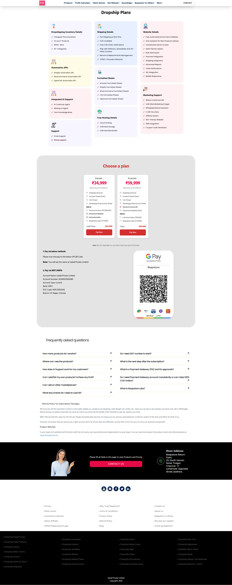

# baapstore-pricing-page

Responsive Pricing Page developed for Baapstore using HTML, CSS, Bootstrap, and JavaScript.

## Live URL
https://www.baapstore.com/pricing

## Project Overview
Developed the pricing page for Baapstore focusing on clean layout structure, responsive design, and clear pricing comparison presentation.

## My Role – Frontend Developer
- Developed the complete pricing page UI
- Designed and structured the layout
- Implemented fully responsive design (Mobile, Tablet, Desktop)
- Styled pricing cards with proper alignment
- Designed CTA buttons and improved visual hierarchy
- Optimized spacing and readability across sections

## Technologies Used
- HTML5
- CSS3
- Bootstrap
- JavaScript

## Key Highlights
- Clean pricing comparison structure
- Fully responsive layout
- Improved UI clarity and user readability

## project screenshots

